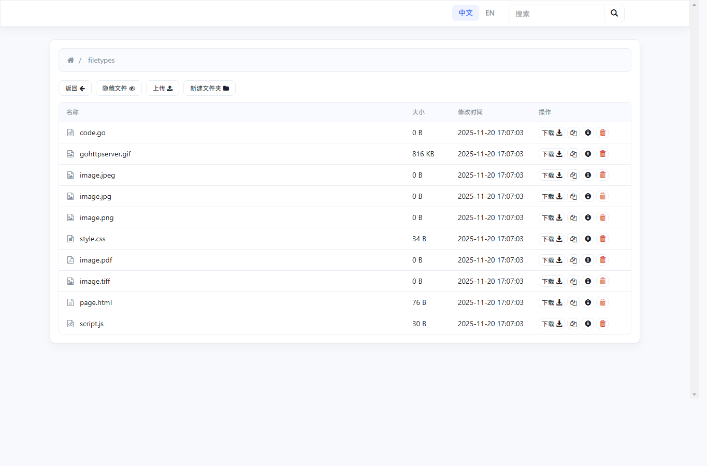
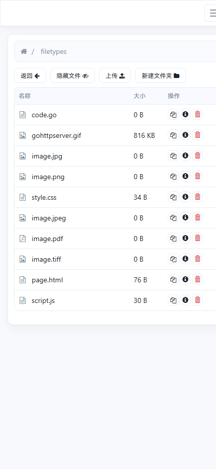

# gohttpserver_cn

`gohttpserver_cn` 是基于官方 [codeskyblue/gohttpserver](https://github.com/codeskyblue/gohttpserver) 的二次优化版本。

它保留了原项目“单个二进制即可启动 HTTP 文件服务器”的核心能力，并围绕中文使用场景、前端交互、移动端显示、安全预览和日常文件管理体验做了增强。适合在局域网、测试环境、临时文件分发、安装包分发等场景中快速搭建一个带网页界面的文件服务器。

## 系统截图

桌面端文件管理界面：



移动端文件管理界面：



## 与官方项目的关系

本仓库不是官方仓库，而是基于官方 gohttpserver 做的优化版本。

- 上游项目：<https://github.com/codeskyblue/gohttpserver>
- 本仓库定位：中文增强、界面优化、交互细节优化和常用部署说明整理
- 核心能力：继续沿用 Go 实现的轻量 HTTP 文件服务器，可打包为独立二进制运行

## 主要优化

- 中文优先界面，保留中英文切换能力。
- 重新整理文件管理界面样式，提升表格、按钮、弹窗、面包屑和移动端可读性。
- 优化长文件名显示，避免文件名挤压布局，并在需要时显示完整名称提示。
- 文件信息弹窗支持更友好的大小、时间和字段本地化展示。
- README 预览禁用原始 HTML 直通，降低上传 Markdown 注入脚本的风险。
- 视频文件可跳转到独立播放页，便于浏览器直接播放常见视频格式。
- 保留上传、删除、新建目录、目录打包下载、复制下载链接、隐藏文件切换等常用操作。
- 保留 APK/IPA 信息识别、二维码安装链接、`.ghs.yml` 目录级权限控制等原项目特色能力。

## 功能概览

- 文件浏览：按目录浏览文件，显示名称、大小、修改时间和文件类型图标。
- 文件操作：下载、复制链接、查看信息、删除文件或目录。
- 上传能力：支持网页拖拽上传，也支持 `curl` 表单上传。
- 目录管理：支持创建目录、目录 zip 打包下载。
- 搜索索引：支持全局文件搜索。
- 权限控制：支持 HTTP Basic Auth、OpenID、oauth2-proxy，以及 `.ghs.yml` 细粒度目录规则。
- 移动端适配：小屏幕下保留核心操作入口，适合手机临时访问和下载。
- 安装包分发：支持 APK/IPA 相关信息和安装链接能力。
- 反向代理：支持 `--prefix` 和 `--xheaders`，便于部署在 Nginx 后面。

## 快速开始

### 环境要求

- Go 1.20 或更高版本
- Git

### 从源码运行

```bash
git clone https://github.com/Staceycgc/gohttpserver_cn.git
cd gohttpserver_cn
go run . --root ./ --addr 127.0.0.1:8000 --upload
```

打开浏览器访问：

```text
http://127.0.0.1:8000
```

### 构建二进制

Windows:

```bash
go build -o gohttpserver-cn.exe .
gohttpserver-cn.exe --root ./ --addr 127.0.0.1:8000 --upload
```

Linux/macOS:

```bash
go build -o gohttpserver-cn .
./gohttpserver-cn --root ./ --addr 127.0.0.1:8000 --upload
```

## 常用命令

启动文件服务器并允许上传：

```bash
go run . --root ./public --port 8000 --upload
```

允许上传、删除和新建目录：

```bash
go run . --root ./public --port 8000 --upload --delete
```

使用 HTTP Basic Auth：

```bash
go run . --root ./public --auth-type http --auth-http username:password
```

设置网页标题和主题：

```bash
go run . --root ./public --title "内部文件分发" --theme green
```

查看所有参数：

```bash
go run . --help
```

## 配置文件

可以通过配置文件集中管理启动参数，例如 [testdata/config.yml](testdata/config.yml)：

```yaml
---
addr: ":4000"
title: "hello world"
theme: green
debug: true
xheaders: true
cors: true
```

启动时指定配置文件：

```bash
go run . --conf testdata/config.yml
```

## 目录权限规则

在某个目录下创建 `.ghs.yml`，可以控制该目录的上传、删除和访问规则。

```yaml
---
upload: false
delete: false
users:
- email: "user@example.com"
  delete: true
  upload: true
  token: 4567gf8asydhf293r23r
accessTables:
- regex: block.file
  allow: false
- regex: visual.file
  allow: true
```

`token` 可用于通过命令行上传文件。

```bash
curl -F file=@foo.txt -F token=4567gf8asydhf293r23r http://127.0.0.1:8000/somedir
```

## Nginx 反向代理

假设服务监听在 `127.0.0.1:8200`：

```nginx
server {
  listen 80;
  server_name your-domain-name.com;

  location / {
    proxy_pass http://127.0.0.1:8200;
    proxy_redirect off;
    proxy_set_header Host $host;
    proxy_set_header X-Real-IP $remote_addr;
    proxy_set_header X-Forwarded-For $proxy_add_x_forwarded_for;
    proxy_set_header X-Forwarded-Proto $scheme;
    client_max_body_size 0;
  }
}
```

启动服务时建议加上：

```bash
go run . --addr 127.0.0.1:8200 --xheaders
```

如果需要挂在子路径，例如 `/files`：

```bash
go run . --addr 127.0.0.1:8200 --prefix /files --xheaders
```

## 项目结构

```text
gohttpserver_cn/
├── assets/                 # 前端页面、样式、脚本和静态资源
├── docker/                 # Docker 构建相关文件
├── scripts/                # 辅助脚本
├── testdata/               # 测试和本地演示用数据
├── docs/screenshots/       # README 使用的系统截图
├── main.go                 # 命令行参数、服务启动和认证入口
├── httpstaticserver.go     # 文件浏览、上传、删除、搜索和目录接口
├── ipa.go                  # IPA 识别和 plist 链接相关逻辑
├── oauth2-proxy.go         # oauth2-proxy 认证适配
├── openid-login.go         # OpenID 登录逻辑
├── zip.go                  # 目录打包下载逻辑
└── *_test.go               # 单元测试
```

## 开发

运行测试：

```bash
go test ./...
```

本地开发时，可以直接用测试目录启动：

```bash
go run . --root testdata --addr 127.0.0.1:8000 --upload --delete --title gohttpserver_cn
```

## License

本项目沿用上游项目的 MIT License，详见 [LICENSE](LICENSE)。
